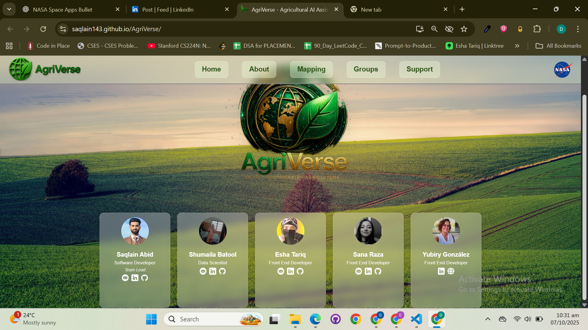
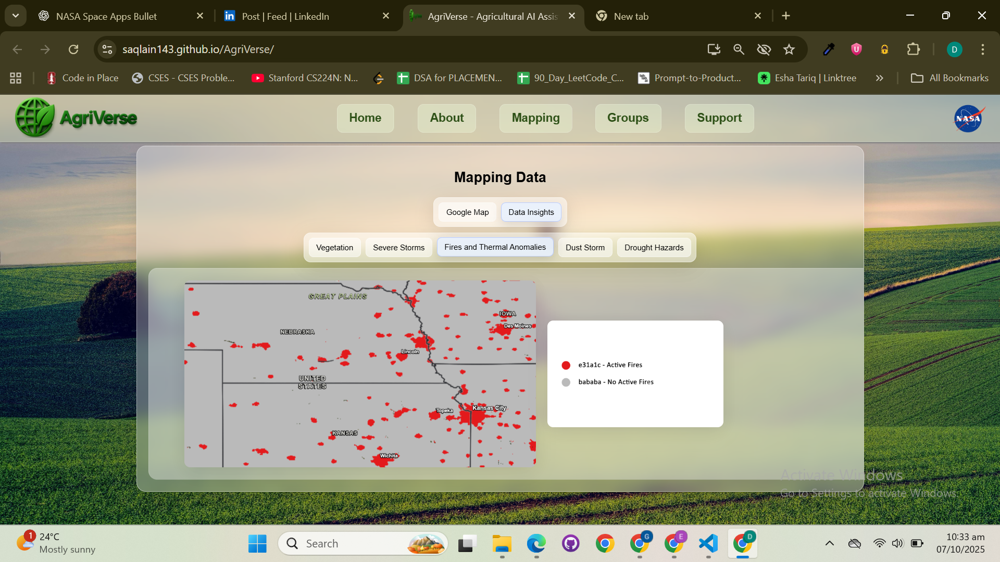
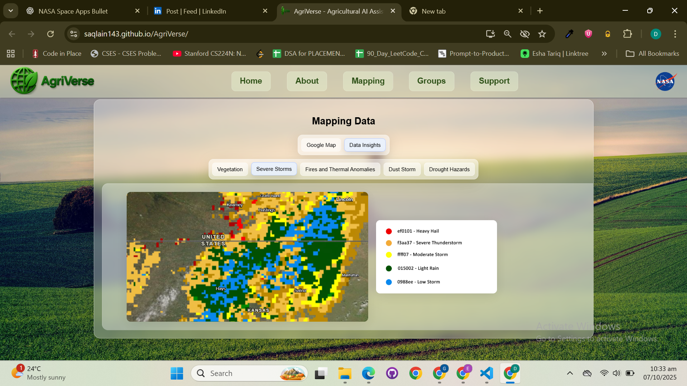

# 🚀 OrbitX Engineers — NASA Space Apps Challenge 2025 🌎  

  
> **Official Open Source Project** built for the **NASA Space Apps Challenge 2025**  
> **Challenge:** *NASA Farm Navigators — Using NASA Data Exploration in Agriculture*  
> **Funded by NASA’s Earth Science Division** through Booz Allen Hamilton, Mindgrub, and SecondMuse  

---

## ✅ Submission Proof & Certificate  
 

---

## 🌾 Mission Overview  

The agriculture community faces a universal challenge: integrating space data into daily farming for sustainability.  
Our solution — **AgriVerse** — transforms **NASA Earth Observation APIs** into an **interactive educational simulator**, allowing users to explore how **climate, irrigation, and soil conditions** influence global crop yields.  

> 🛰️ *Yes, this app uses real NASA APIs — authenticated via NASA Earthdata Login.*  
> From orbit to orchard, we bring **space data down to Earth.** 🌾  

---

## 💻 Tech Stack  

| Category | Technology |
|-----------|-------------|
| Frontend | React.js, JavaScript, TailwindCSS |
| Backend | Node.js, Express.js |
| APIs | NASA Earth Observation APIs (Climate, Soil, Vegetation) |
| Data Science | Python, Pandas, Matplotlib |
| Visualization | Plotly, Chart.js |
| Version Control | GitHub (Open Source) |

---

## 👨‍🚀 Team OrbitX Engineers  

| Name | Role | Country | Bio |
|------|------|----------|-----|
| **Saqlain Abid** | 🧑‍💻 Team Lead & Software Developer | 🇵🇰 Pakistan | Directed the project architecture and NASA API backend integration. |
| **Eesha Tariq** | 👩‍💻 Software Engineer | 🇵🇰 Pakistan | Stanford Section Leader • Founder of AceMed AI • Led frontend with NASA data visualization. |
| **Shumaila Batool** | 👩‍🔬 Data Scientist | 🇵🇰 Pakistan | Processed NASA climate datasets and developed statistical models for crop simulation. |
| **Evan Li** | 👨‍💻 Front-End Developer | 🇺🇸 United States | Created responsive UIs and geospatial map layers using NASA satellite imagery. |
| **Taizo Rashid** | 👨‍💻 Front-End Developer | 🇺🇸 United States | Designed intuitive interfaces and enhanced cross-platform user experience. |
| **Dr. Yubiry González** | 👩‍🔬 Data Scientist (PhD, Computer Science) | 🇧🇷 Brazil | Expert in ML & Signal Processing • Ensured scientific validation of simulation models. |



---

## 🛰️ NASA API Integration  

- Authenticated via **NASA Earthdata Login System**  
- Accessed real-time data on:
  - 🌡️ Temperature  
  - 🌱 Vegetation Indices  
  - 💧 Soil Moisture  
  - ☁️ Climate & Storm Forecast  
- Visualized insights through **React + Plotly.js** dashboards  
- Enabled users to simulate sustainable farming with **live NASA datasets**

### 🖼️ Sample Visualizations  

| Visualization | Description |
|----------------|--------------|
|  | AI-based vegetation growth prediction |
|  | Thermal anomalies detected via NASA data |
|  | Global storm and weather prediction insights |

---

## 🌟 Impact  

By blending **space technology** and **sustainable agriculture**,  
we empower students, farmers, and researchers to **learn through simulation** —  
making real NASA data accessible, engaging, and educational.  

> “The best way to save Earth is to look at it from space — and that’s exactly what we did.” 🌍  

---

## 💬 Open Source  

🔓 Licensed under the **MIT License**  
📂 Contributions welcome! Fork, innovate, and improve.  

```bash
# Clone this repository
git clone https://github.com/AgriVUE/AgriView.git

# Install dependencies
npm install

# Start development
npm start
